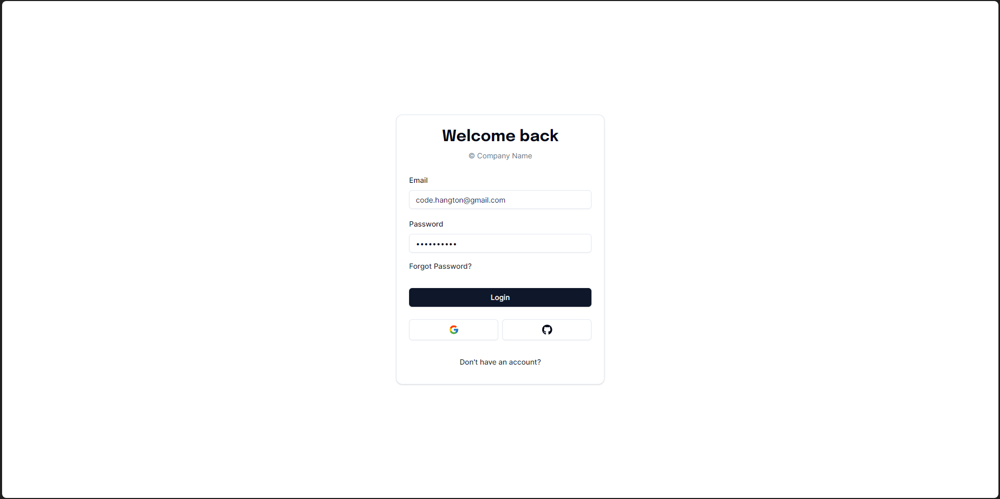
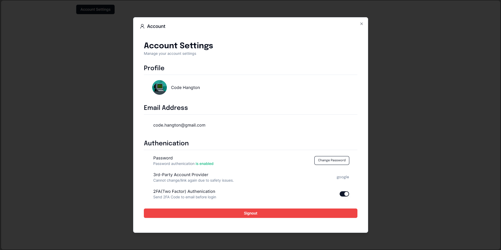

# Introduction

This is a Authjs toolkit base on [Next Auth v5](https://authjs.dev/). With most of the important components to form a comprehensive authenication system for web development.

# Techniques

- T3 Stack (Next.js 14, TRPC, and Tailwind CSS)
- Auth.js (Next Auth v5)
- Shadcn UI
- Resend
- Prisma with MYSQL as default
- MinIO
- and more

# Environment Variables

`.env`

```
DATABASE_URL=
AUTH_SECRET=
GITHUB_CLIENT_ID=
GITHUB_CLIENT_SECRET=
GOOGLE_CLIENT_ID=
GOOGLE_CLIENT_SECRET=
RESEND_API_KEY=
MINIO_ACCESS_KEY=
MINIO_SECRET_KEY=
MINIO_END_POINT=
MINIO_APP_URL=
MINIO_PORT=
NEXT_PUBLIC_APP_URL=
```

# Gallery




# Remarks

1. Recommend to stay `@tanstack/react-query` at v4 so as to peer with `@trpc/client`
2. Recommend to stay `next-auth` at @5.0.0-beta.4 and `@auth/prisma-adapter` at @1.0.14 respectively so as to make sure the code runs with no error
